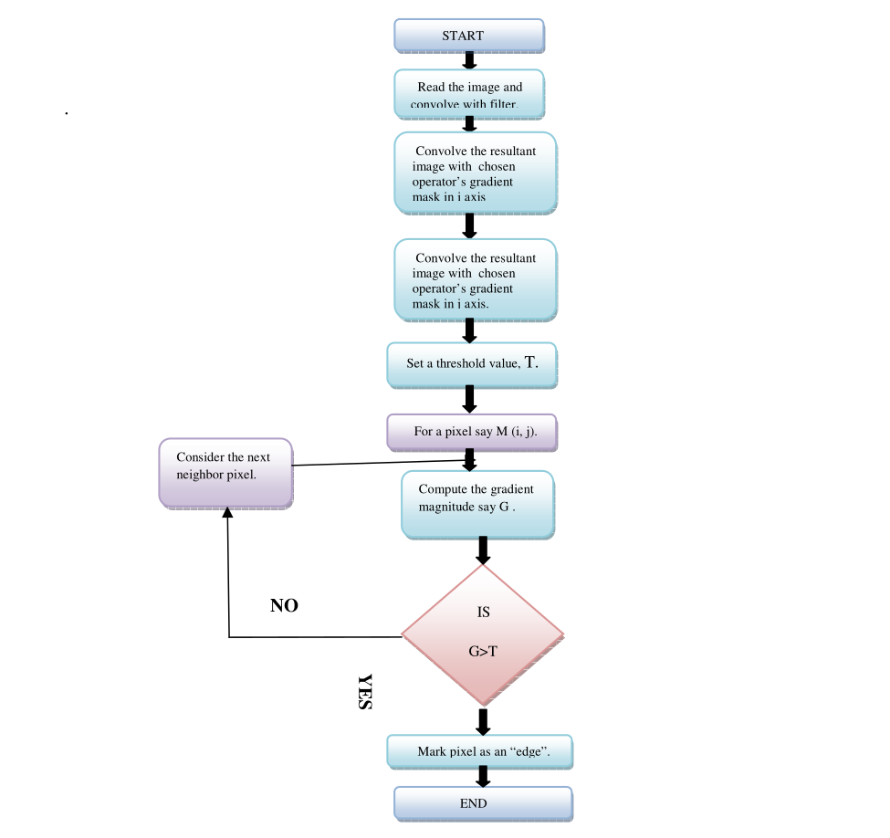
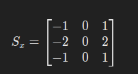
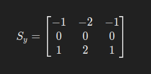
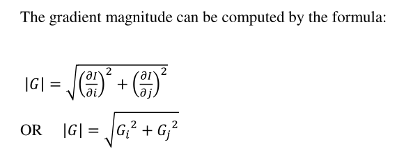
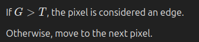

# **Edge Detection Algorithm**

## **1. Introduction**
Edge detection is a fundamental operation in image processing that identifies significant transitions in intensity. The **Sobel operator** is widely used because it provides a good balance between edge detection accuracy and noise reduction.

## **2. Steps for Sobel Edge Detection**

### **Step 1: Read the Image and Apply a Smoothing Filter**
Before detecting edges, the image is first smoothed to reduce noise. This is achieved by convolving the image with a Gaussian filter:

where:
-  I(x,y) is the original image.

### **Step 2: Compute the Gradient in the X-Direction**
To detect horizontal edges, the smoothed image is convolved with the Sobel operator's mask in the **x-direction**:

where:

### **Step 3: Compute the Gradient in the Y-Direction**
To detect vertical edges, the smoothed image is convolved with the Sobel operator’s mask in the **y-direction**:

where:

### **Step 4: Compute the Gradient Magnitude**
The overall gradient magnitude at each pixel \( M(i,j) \) is computed using:

This step determines the strength of the edge at each pixel.

### **Step 5: Apply a Threshold (T) to Classify Edges**
To classify pixels as edges or non-edges, a threshold \( T \) is applied:

Choosing \( T \) can be done using:
- **Otsu’s method** (adaptive thresholding)

### **Step 6: Repeat for All Pixels**
The above steps are applied to every pixel in the image until all edges are detected.
