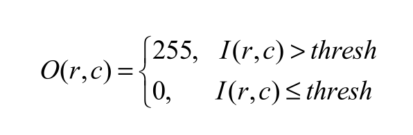
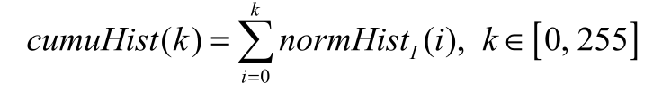
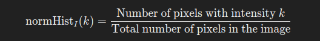
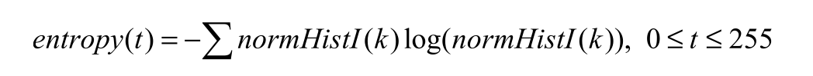
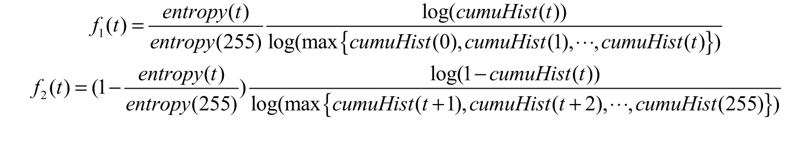
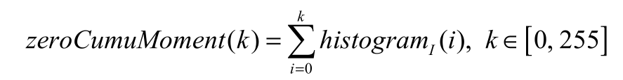
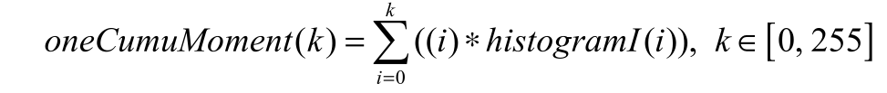
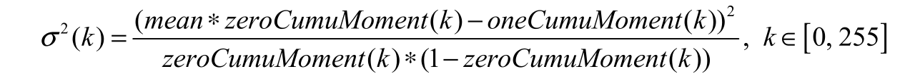
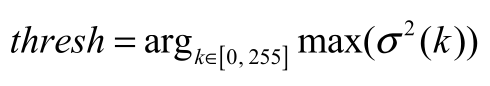

# Image Segmentation Using Thresholding and Entropy-Based Methods

## **Introduction**
Image segmentation is an essential process in image processing, where an image is divided into meaningful parts. One of the most common segmentation techniques is **thresholding**, which converts a grayscale image into a binary image by setting pixel intensity values based on a predefined threshold.

When dealing with **low-contrast images**, it is necessary to first enhance the contrast before applying thresholding. This document outlines various thresholding techniques, including **global thresholding, entropy-based thresholding, and Otsu's method**.

---
## **1. Global Threshold Segmentation**
### **Definition**
Given an input image \( I \) with height \( H \) and width \( W \), where \( I(r, c) \) represents the gray value at row \( r \) and column \( c \), the output image after global thresholding is \( O \). The output is determined as follows:

This means pixels with values greater than the threshold \( T \) are set to **255 (white)**, and those less than or equal to \( T \) are set to **0 (black)**.

---
## **2. Entropy-Based Thresholding**
### **Definition**
Entropy-based thresholding selects a threshold by maximizing the entropy function. The probability distribution of grayscale values in an image is given by its **normalized histogram**, denoted as \( \text{normHist}_I(k) \), where \( k \) represents a grayscale value (0 to 255).

### **Steps for Calculating the Entropy Threshold**
#### **Step 1: Calculate the cumulative probability histogram of I**

#### **Step 2: Calculate the entropy of each gray level and mark it as:**

#### **Step 3: Calculate the t value that maximizes f (t ) = f1 (t ) + f 2 (t ) , which is the threshold value obtained, as thresh = arg t max( f (t )) , where:**

#### **Step 4: Determine the Optimal Threshold**

    thresh = argt max( f (t ))
### This means we search for the value of t that maximizes the sum of foreground and background entropy contributions.

---
## **3. Otsu’s Thresholding Method**
### **Definition**
Otsu’s method determines the threshold by maximizing the inter-class variance, assuming that an image contains two main groups of pixels (foreground and background).

### **Steps for Otsu’s Algorithm**
#### **Step 1: calculate the zero-order cumulative moments**

#### **Step 2: Compute the First-Order Cumulative Moments**

#### **Step 3: Compute the Mean Gray Level**

#### **Step 4: Compute the Variance for Each Threshold \( k \)**

#### **Step 5: Find the Optimal Threshold**

Otsu’s method selects the threshold that **maximizes inter-class variance**, ensuring the best separation between foreground and background.

---
## **Conclusion**
Threshold-based image segmentation methods, including **global thresholding, entropy-based thresholding, and Otsu’s method**, provide effective ways to convert grayscale images into binary images.

- **Global Thresholding**: Simple but requires manual threshold selection.
- **Entropy-Based Thresholding**: Uses information theory to find an optimal threshold.
- **Otsu’s Method**: Automatically selects the threshold by maximizing variance between foreground and background.

Choosing the right method depends on the nature of the image. For low-contrast images, contrast enhancement should be performed before applying thresholding.

---

